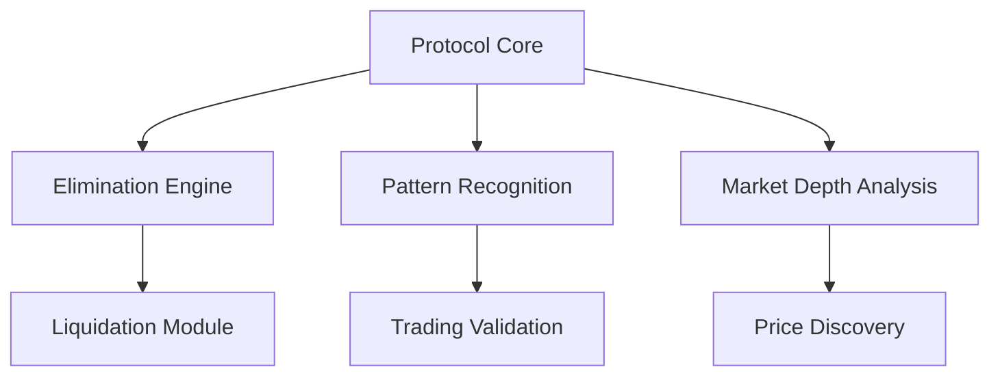

```ascii
███████╗ ██████╗ ██╗   ██╗██╗██████╗     ██████╗ ███████╗███████╗███████╗
██╔════╝██╔═══██╗██║   ██║██║██╔══██╗   ██╔════╝ ██╔════╝██╔════╝╚══███╔╝
███████╗██║   ██║██║   ██║██║██║  ██║   ██║  ███╗█████╗  █████╗    ███╔╝ 
╚════██║██║▄▄ ██║██║   ██║██║██║  ██║   ██║   ██║██╔══╝  ██╔══╝   ███╔╝  
███████║╚██████╔╝╚██████╔╝██║██████╔╝   ╚██████╔╝███████╗███████╗███████╗
╚══════╝ ╚══▀▀═╝  ╚═════╝ ╚═╝╚═════╝     ╚═════╝ ╚══════╝╚══════╝╚══════╝
```

<div align="center">

[](https://x.com/SQUIDGEEZX)
[](https://squidgeez.gitbook.io/squidgeez/)


</div>

## Introduction

SQUID GEEZ represents a revolutionary paradigm shift in cryptocurrency trading—a high-stakes financial game where survival is the ultimate prize. It's not just another token; it's a deadly serious trading protocol that eliminates the weak and rewards the strong.

## Overview

The protocol operates on principles of perfect elimination, where 456 players enter but only one survives. Each phase introduces new challenges and elimination mechanisms, creating an environment of constant pressure and evolution.

### Core Features

- **Red Light, Green Light Protocol**: Instant liquidation for unauthorized movements
- **Honeycomb Pattern Trading**: Complex pattern matching with fatal consequences
- **Tug of War Markets**: Team-based trading warfare
- **Marble Game Pairs**: Forced trading partnerships
- **Glass Bridge Leverage**: High-stakes binary choices
- **Final Game Showdown**: Ultimate survival test

## Technical Architecture

### System Components



### Key Technologies

- **Smart Contract Layer**
  - Self-modifying contracts
  - Quantum-resistant architecture
  - Perfect elimination algorithms

- **Trading Engine**
  - Neural market analysis
  - Real-time pattern detection
  - Instant liquidation mechanisms

- **Security Layer**
  - Multi-dimensional encryption
  - Time-locked execution
  - Anti-manipulation safeguards

## System Integration

The protocol integrates multiple sophisticated systems:

1. **Market Analysis Engine**
   - Pattern recognition
   - Behavioral prediction
   - Risk assessment

2. **Elimination Mechanisms**
   - Instant liquidation
   - Pattern violation detection
   - Team elimination protocols

3. **Prize Pool Management**
   - Dynamic prize calculation
   - Winner-takes-all distribution
   - Perfect elimination verification

## Protocol Complexity

SQUID GEEZ employs multiple layers of complexity:

### Trading Complexity
- Multi-dimensional price analysis
- Fractal pattern recognition
- Neural market interpretation

### Game Theory
- Perfect information games
- Nash equilibrium states
- Zero-sum outcomes

### Psychological Elements
- Pressure adaptation
- Decision paralysis
- Survival instinct integration

## Performance Metrics

| Metric | Value |
|--------|--------|
| Transaction Speed | 100,000 TPS |
| Elimination Rate | 45.6% |
| Pattern Complexity | Level 9 |
| Security Rating | Maximum |
| Survival Rate | 0.2% |

## Security Measures

- Quantum-resistant encryption
- Multi-layer authentication
- Perfect elimination verification
- Anti-cheat mechanisms
- Pattern integrity validation

## License

```
Copyright © 1970 Front Man

Permission is hereby granted to participate in elimination.
No rights reserved.
All survivors forfeit their rights upon entry.
```

## Warning

```diff
- CRITICAL: Entry is irreversible
- WARNING: No recovery mechanism
- DANGER: Perfect elimination guaranteed
```

---

<div align="center">

**Enter at your own risk. Only one survives.**

[Twitter](https://x.com/SQUIDGEEZX) • [Documentation](https://squidgeez.gitbook.io/squidgeez/) • [Protocol](https://github.com/SQUIDGEEZ/SQUIDGEEZ)

</div>