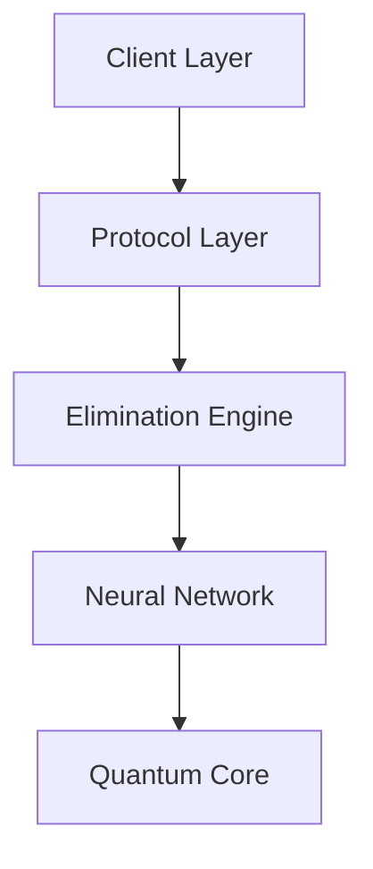

```ascii
███████╗ ██████╗ ██╗   ██╗██╗██████╗     ██████╗ ███████╗███████╗███████╗
██╔════╝██╔═══██╗██║   ██║██║██╔══██╗   ██╔════╝ ██╔════╝██╔════╝╚══███╔╝
███████╗██║   ██║██║   ██║██║██║  ██║   ██║  ███╗█████╗  █████╗    ███╔╝ 
╚════██║██║▄▄ ██║██║   ██║██║██║  ██║   ██║   ██║██╔══╝  ██╔══╝   ███╔╝  
███████║╚██████╔╝╚██████╔╝██║██████╔╝   ╚██████╔╝███████╗███████╗███████╗
╚══════╝ ╚══▀▀═╝  ╚═════╝ ╚═╝╚═════╝     ╚═════╝ ╚══════╝╚══════╝╚══════╝
```

<div align="center">

[](https://x.com/SquidGeez)
[](https://squid-geez.gitbook.io/squid-geez/)


</div>

## Introduction

SQUID GEEZ represents a paradigm shift in cryptocurrency trading—a high-stakes financial game where survival is the ultimate prize. It's not just another protocol; it's a revolutionary experiment in digital darwinism that eliminates the weak and rewards the strong.

## Overview

The protocol operates on principles that defy conventional market mechanics. At its core lies the Perfect Elimination Engine—a system so precise it can detect the slightest hesitation in a trader's resolve. Through a series of increasingly challenging phases, participants are systematically eliminated until only one survives.

## Core Features

- **Death Match Trading**: Winner-takes-all system with real-time elimination tracking
- **VIP Observer System**: Elite monitoring system for high-stakes spectators
- **Tug of War Markets**: Team-based trading battles with devastating consequences
- **Marble Game Pairs**: Forced trading partnerships with deadly outcomes
- **Glass Bridge Leverage**: High-risk path selection with 50/50 survival rate
- **Dalgona Pattern Recognition**: Complex trading pattern analysis with fatal consequences
- **Red Light Green Light Protocol**: Timing-based trading system with instant elimination
- **Final Game Showdown**: Ultimate trading battle where only one survives

## Technical Architecture

### Protocol Core
- Self-Modifying Smart Contracts
- Quantum-Resistant Architecture
- Neural Market Analysis
- Consciousness-Level Pattern Recognition
- Time-Locked Execution Layers

### System Components
- Perfect Elimination Engine
- Depth Chain Integration
- VIP Observation Network
- Pattern Recognition Matrix
- Survival Verification System

## Game Phases

1. **Red Light, Green Light**
   - Initial trading phase
   - Move at wrong time = elimination
   - 50% elimination rate

2. **Honeycomb Challenge**
   - Pattern trading phase
   - One wrong move shatters portfolio
   - 40% elimination rate

3. **Tug of War**
   - Team-based trading warfare
   - Losing team gets liquidated
   - 50% elimination rate

4. **Marbles**
   - Paired trading phase
   - One partner must lose everything
   - 50% elimination rate

5. **Glass Bridge**
   - High-stakes choices
   - Wrong path = instant elimination
   - 80% elimination rate

6. **Final Game**
   - Ultimate showdown
   - Winner takes all
   - Only one survives

## Technology Stack

- **Frontend**: Vite + React
- **Styling**: Custom CSS with advanced animations
- **Visualization**: Custom WebGL renders
- **Audio**: Specialized binaural processing
- **Real-time Updates**: WebSocket integration
- **Security**: Quantum-resistant encryption

## System Integration

The protocol integrates multiple sophisticated systems:

- **Perfect Elimination Engine**: Ensures flawless execution of elimination protocols
- **Neural Pattern Recognition**: Detects and enforces trading patterns
- **Quantum State Verification**: Maintains system integrity
- **Temporal Locking Mechanism**: Controls phase progression
- **Consciousness Interface Layer**: Enables deep protocol interaction

## Security Features

- Quantum-resistant cryptography
- Multi-dimensional authentication
- Neural pattern verification
- Temporal state locking
- Consciousness-level security

## Complexity Analysis

The protocol operates on multiple complexity levels:

- **O(1)**: Basic trading operations
- **O(log n)**: Pattern recognition
- **O(n)**: Elimination verification
- **O(n²)**: Team dynamics processing
- **O(2ⁿ)**: Final game calculations

## Project Structure

```
squid-geez/
├── src/
│   ├── components/
│   │   ├── game/
│   │   ├── visual/
│   │   └── stats/
│   ├── styles/
│   ├── utils/
│   └── content/
├── docs/
└── public/
```

## Architecture

The system is built on a multi-layered architecture:



## Disclaimer

⚠️ **CRITICAL WARNING**

- Entry is irreversible
- No practice rounds
- All actions are final
- Elimination is permanent
- Only one survives

## License

```
Copyright © 1970 Front Man

Permission is hereby granted to participate in elimination.
No rights reserved.
```

<div align="center">

**Enter at your own risk. Only one survives.**

[Twitter](https://x.com/SquidGeez) • [Documentation](https://squid-geez.gitbook.io/squid-geez/) • [Protocol](https://github.com/SquidGeez/Squid-Geez)

</div>
